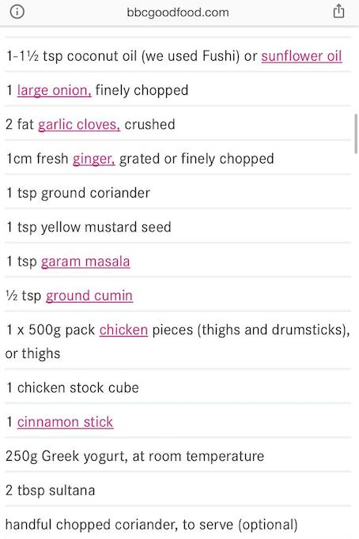

# Simple chicken curry

Pinched from a BBC website. Cooked it once with Amy's fam, bloody delish.

## Ingredients

Piccy because cba.

## Method

1. Fry onions in a pan for 5-10 minutes with a pinch of salt (quite a low heat, maybe longer if you want more flavour.)
2. Add ginger, a chopped bunch of coriander, cumin and garam masala and cook until fragrant.
3. Chop chicken thighs into thirds. Add to the pot and cook for a little bit until white. 
4. Add chicken stock and then add the cinnamon stick. Cook for 45-60 mins with the lid off until the sauce at the bottom goes a bit thick.
5. Remove the cinnamon stick.
6. Add greek yoghurt and stir through. Serve with rice or naan bread, whatever you like.
